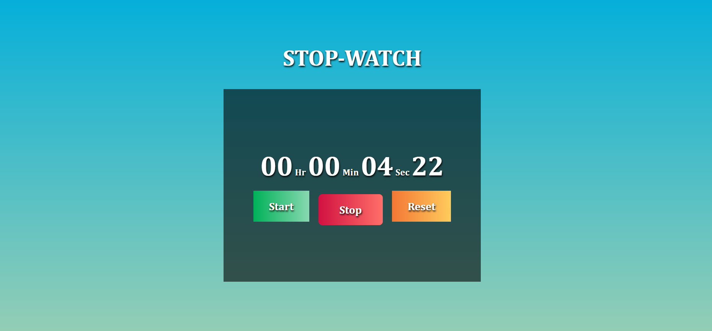

# Stop-Watch

## Overview

### This is a Project on JavaScript, with some animation using css, there are 3 buttons performing respective task of stopwatch!

## My process

### Built with

- Visual Studio Code
- Semantic HTML5 markup
- CSS custom properties
- Flexbox
- CSS
- JavaScript
- Mobile-first workflow
- [React](https://reactjs.org/) - JS library
- [Next.js](https://nextjs.org/) - React framework

## Author

- Linkedin - [Sonu-Dutta](https://www.linkedin.com/in/sonu-dutta-6900b3218)
- Twitter - [@sonudutta9999](https://mobile.twitter.com/sonudutta9999)

